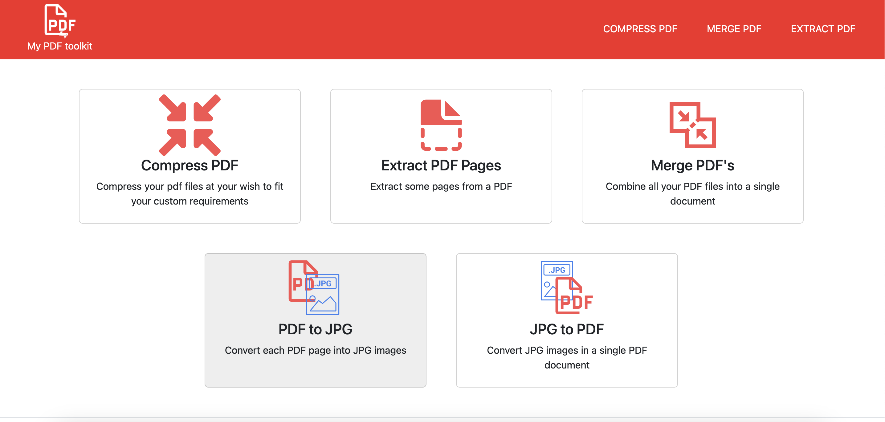

# My PDF Toolkit


[](https://www.gnu.org/licenses/gpl-3.0)

This project has the following set of tools for working with PDF files

* Compress PDF
* Reorder and Remove pages from a PDF
* Merge PDF files
* Convert PDF into images
* Convert images into a single PDF



## How to run

### *Online: 
https://mmgkxuq3hr.us-east-1.awsapprunner.com/ 

*The url can be out for service due to billing

### Locally

Download the repo
```
git clone https://github.com/francisdayl/my_pdf_toolkit.git
```
Make sure docker is running in your system, then

```
docker compose up
```

Go to

```
http://localhost:8000/
```

## For running profiler
```
scalene profiling/profiling.py
```


## Built with


- [Flask](https://flask.palletsprojects.com/en/3.0.x/) - As web framework
- [Docker](https://www.docker.com/) - For Containerizing the app and fast deploying
- [AWS | App Runner | ECR](https://aws.amazon.com/apprunner/) - Cloud Deployment
- [Bootstrap](https://getbootstrap.com/) - For fast ui styling
- [Black](https://pypi.org/project/black/) - Code Styling
- [Pytest](https://docs.pytest.org/en/stable/) - Testing
- [Scalene](https://pypi.org/project/scalene/0.9.15/) - Profiling
- [Pypdf](https://pypi.org/project/pypdf/) - PDF Manipulation
- [pdf2image](https://pypi.org/project/pdf2image/) - Pdf to image